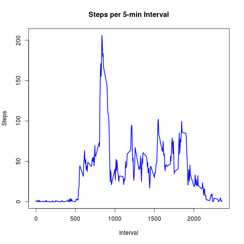
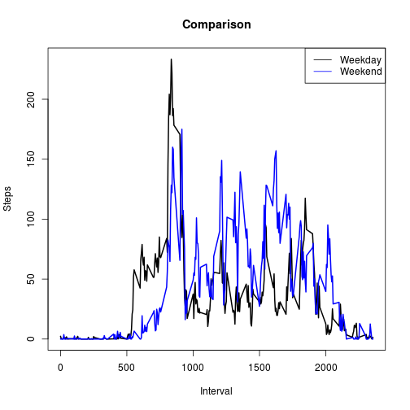

Load required packages

```r
library(lattice)
library(ggplot2)
library(lubridate)
library(xtable)
```

## Loading and preprocessing the data
We load dataset from zipped file with unz(), then look at its structure using str().

```r
data <- read.table(unz("./activity.zip", "activity.csv"), header=TRUE, sep=",", na.strings="NA")
str(data)
```

```
## 'data.frame':	17568 obs. of  3 variables:
##  $ steps   : int  NA NA NA NA NA NA NA NA NA NA ...
##  $ date    : Factor w/ 61 levels "2012-10-01","2012-10-02",..: 1 1 1 1 1 1 1 1 1 1 ...
##  $ interval: int  0 5 10 15 20 25 30 35 40 45 ...
```

Next, convert the data column using ymd() from package lubridate, and check out the revised structure.

```r
data$date <- ymd(data$date)
str(data)
```

```
## 'data.frame':	17568 obs. of  3 variables:
##  $ steps   : int  NA NA NA NA NA NA NA NA NA NA ...
##  $ date    : POSIXct, format: "2012-10-01" "2012-10-01" ...
##  $ interval: int  0 5 10 15 20 25 30 35 40 45 ...
```

Great. Our 'data' column is now in standard POSIXct format, so that R will understand the data with respect to dates and not some string of characters/numbers.

## What is mean total number of steps taken per day?
Try a histogram plot to get a preliminary understand of the dataset. Plot total steps taken each day.

```r
plotstepday <- with(data, aggregate(steps, list(date), sum))
hist(plotstepday$x, main="Histogram of Steps Taken Each Day", xlab="Total Number Each Day")
```

 

Find the mean and median of steps taken each day:

```r
Mean   <-  mean(plotstepday$x, na.rm=TRUE)
Median <-  median(plotstepday$x, na.rm=TRUE)
```

The mean number of steps taken per day is **10766** while the median is **10765**

## What is the average daily activity pattern?

```r
intval <- data[as.character(data$date)=="2012-10-01",]$interval
intval_avg <- with(data, aggregate(steps, list(interval), mean, na.rm=TRUE))
plot(intval, intval_avg$x, "l", main="Steps per 5-min Interval (averaged across all days)", xlab="Interval", ylab="Steps", lwd=2)
```

 

From the plot, we see that steps taken are generally lower in the beginning and end of the entire recorded acitvity. There are some peaks, which could be due to a switch to brisk from slow walking. 


```r
maxval <- max(intval_avg$x)
max_intval <- intval[which.max(intval_avg$x)]
```

The average 5-min interval containing the maximum number of steps is the **835** interval at a maximum of **206.1698113** steps.

## Imputing missing values

We noted that there were several NA values in the dataset. Let's count now many are there in the entire dataset.

```r
totalnas <- sum(is.na(data$steps))
datasetlen <- length(data$steps)
```

Out of **17568** entries in the entire dataset, there are **2304** NA entries, that is quite a bit.

Our strategy is to fill in the missing values by using the mean of that 5-minute interval, that is values from the plot above. 


```r
intvalna <- data[is.na(data$steps),]$interval
tofill <- intval_avg[intval_avg$Group.1 %in% intvalna,]
data <- data[c("date", "steps", "interval")]
datafilled <- data
for (i in 1:nrow(datafilled)) {
  if(is.na(datafilled$steps[i])) {
    datafilled$steps[i] <- tofill$x[i]
    }
  }
```

Now, the new dataset has no NAs, we also print out the old dataset for comparison.

```r
head(datafilled, 20)
```

```
##          date     steps interval
## 1  2012-10-01 1.7169811        0
## 2  2012-10-01 0.3396226        5
## 3  2012-10-01 0.1320755       10
## 4  2012-10-01 0.1509434       15
## 5  2012-10-01 0.0754717       20
## 6  2012-10-01 2.0943396       25
## 7  2012-10-01 0.5283019       30
## 8  2012-10-01 0.8679245       35
## 9  2012-10-01 0.0000000       40
## 10 2012-10-01 1.4716981       45
## 11 2012-10-01 0.3018868       50
## 12 2012-10-01 0.1320755       55
## 13 2012-10-01 0.3207547      100
## 14 2012-10-01 0.6792453      105
## 15 2012-10-01 0.1509434      110
## 16 2012-10-01 0.3396226      115
## 17 2012-10-01 0.0000000      120
## 18 2012-10-01 1.1132075      125
## 19 2012-10-01 1.8301887      130
## 20 2012-10-01 0.1698113      135
```

```r
head(data, 20)
```

```
##          date steps interval
## 1  2012-10-01    NA        0
## 2  2012-10-01    NA        5
## 3  2012-10-01    NA       10
## 4  2012-10-01    NA       15
## 5  2012-10-01    NA       20
## 6  2012-10-01    NA       25
## 7  2012-10-01    NA       30
## 8  2012-10-01    NA       35
## 9  2012-10-01    NA       40
## 10 2012-10-01    NA       45
## 11 2012-10-01    NA       50
## 12 2012-10-01    NA       55
## 13 2012-10-01    NA      100
## 14 2012-10-01    NA      105
## 15 2012-10-01    NA      110
## 16 2012-10-01    NA      115
## 17 2012-10-01    NA      120
## 18 2012-10-01    NA      125
## 19 2012-10-01    NA      130
## 20 2012-10-01    NA      135
```

Histogram plot for the dataset with NAs filled in:

```r
plotstepday_nona <- with(datafilled, aggregate(steps, list(date), sum))
hist(plotstepday_nona$x, main="Histogram of Steps Taken Each Day", xlab="Total Number Each Day")
```

 


```r
## Get the mean and median values for each day
Mean  <-  mean(plotstepday_nona$x, na.rm=TRUE)
Median <-  median(plotstepday_nona$x, na.rm=TRUE)
```

After imputing missing data, mean number of steps taken per day is **10766** while the median is **10765** There seem to be no changes when using mean of the 5-min interval to imputing missing values.

## Are there differences in activity patterns between weekdays and weekends?
We add a new column to distinguish weekdays from weekends, using the weekdays() function.

```r
datafilled$dayweek <- weekdays(datafilled$date)
datafilled$weekend <- datafilled$dayweek
for (i in 1:nrow(datafilled)) {
  if (datafilled$dayweek[i] == "Saturday" | datafilled$dayweek[i] == "Sunday") {
    datafilled$weekend[i] <- "Weekend"
  } else {
    datafilled$weekend[i] <- "Weekday"
  }
}
```

Split weekday and weekend dataset and plot time series again.

```r
weekdaydata <- datafilled[datafilled$weekend == "Weekday", ]
weekenddata <- datafilled[datafilled$weekend == "Weekend", ]
head(weekdaydata); head(weekenddata)
```

```
##         date     steps interval dayweek weekend
## 1 2012-10-01 1.7169811        0  Monday Weekday
## 2 2012-10-01 0.3396226        5  Monday Weekday
## 3 2012-10-01 0.1320755       10  Monday Weekday
## 4 2012-10-01 0.1509434       15  Monday Weekday
## 5 2012-10-01 0.0754717       20  Monday Weekday
## 6 2012-10-01 2.0943396       25  Monday Weekday
```

```
##            date steps interval  dayweek weekend
## 1441 2012-10-06     0        0 Saturday Weekend
## 1442 2012-10-06     0        5 Saturday Weekend
## 1443 2012-10-06     0       10 Saturday Weekend
## 1444 2012-10-06     0       15 Saturday Weekend
## 1445 2012-10-06     0       20 Saturday Weekend
## 1446 2012-10-06     0       25 Saturday Weekend
```

```r
weekday_avg <- with(weekdaydata, aggregate(steps, list(interval), mean, na.rm=TRUE))
weekend_avg <- with(weekenddata, aggregate(steps, list(interval), mean, na.rm=TRUE))
par(mfrow=c(2,1))
plot(intval, weekday_avg$x, "l", main="Weekday", xlab="Interval", ylab="Steps", lwd=2)
plot(intval, weekend_avg$x, "l", main="Weekend", xlab="Interval", ylab="Steps", lwd=2)
```

 

It can be a little difficult to make comparison from the panel plots, we plot both wekdays and weekends data into a single plot.


```r
par(mfrow=c(1,1))
plot(intval, weekday_avg$x, "l", main="Comparison", xlab="Interval", ylab="Steps", lwd=2)
lines(intval, weekend_avg$x, col="blue", lwd=2)
legend("topright", c("Weekday", "Weekend"), lty = 1, col = c("black", "blue"))
```

 

Clearly, the step counts throughout the day between weekends and weekdays are not the same. However, it is difficult to quantify if the differences are due random errors from the analysis we have done so far. 

At least, we should be able to say that step counts increases at a later interval as compared to weekdays, maybe it is because people tend to start their day later in the weekends.
